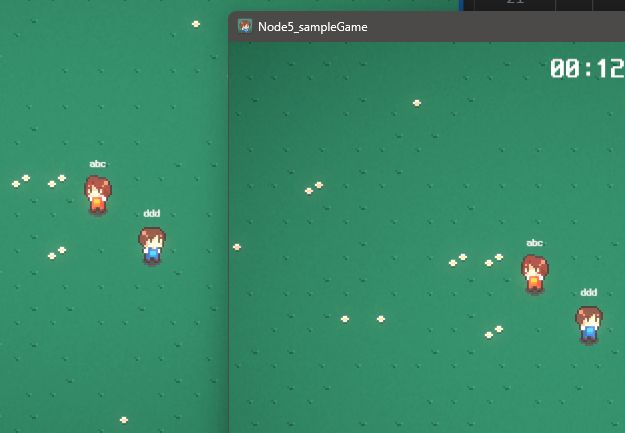

# m-tcp-game-server
#내일배움캠프 스파르타 멀티플레이 게임서버 

TCP 멀티플레이어 게임 서버 만들기

개요
Node.js의 기본 모듈인 net의 내장 socket을 이용하여 TCP 게임 서버를 미리 빌드된 게임 클라이언트 사양에 맞춰 구현하고, 여러 클라이언트 유저 간 위치 정보를 동기화 해보는 것이 목적입니다. 위치 정보 동기화에는 **Latency 기반의 추측 항법 (Dead Reckoning)**을 적용합니다.

과제 Specification: https://teamsparta.notion.site/Chapter-5-060313f2b3da4ec39e729621a6d81d8a

게임 클라이언트 repository: https://github.com/Ho-yeong/node5_unity_sample 

위의 Assets 디렉토리를 현재 repository의 client 디렉토리에 있는 Assets로 덮어 썼습니다.

뭔가 재밌으면서도 어렵당...